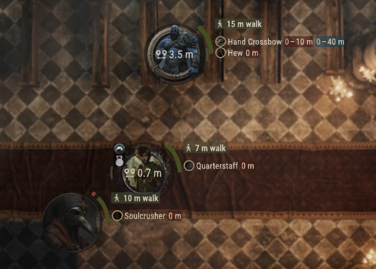
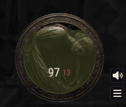

# Shadows & Secrets

A Foundry VTT add-on that deepens immersion by presenting live, context-sensitive environmental details through each character's perspective.

## Here Be Dragons

“I endeavoured to turn the ocean to steam by my will alone—only to find its waves dragging me down into oblivion.”

- Limited testing performed.
- Slightly over-engineered.
- Cartful of technical debt. Features > technical debt repayment
- Tested on and support for DnD5e. Additional system support available upon request.

## Features

### Health
- **Health Arc**: A visual gauge of an actor’s current and temporary health. For tokens not owned by the player, accuracy depends on the controlled token’s passive perception.

### Tracking Reference Number
- **Tally-Ho**: Assign all non-friendly tokens a unique three-digit TRN prefixed by Contact, Bogey, or Bandit based on their disposition (secret, neutral, or hostile). Now, the mage can say:
  
“Tally-Ho! Bandits at 2 o’clock. Engaging with Fireball: Bandit 067, 089, 075, 066, and 033.”

    

- **Health Display**: A clear, on-screen indicator showing the controlled token’s health status.

    

## Usage
- **Hold M**: Display the Health Arc for your token.

    &nbsp;&nbsp;&nbsp;&nbsp;&nbsp;

